<!-- TOC -->

- [前言](#前言)
- [1、容器的初始化（一）之 Root WebApplicationContext 容器](#1容器的初始化一之-root-webapplicationcontext-容器)
- [2、容器的初始化（二）之 Servlet WebApplicationContext 容器](#2容器的初始化二之-servlet-webapplicationcontext-容器)
    - [DispatcherServlet继承类图详解](#dispatcherservlet继承类图详解)
- [3、容器的初始化（三）之 Servlet 3.0 集成](#3容器的初始化三之-servlet-30-集成)
- [4、容器的初始化（四）之 Spring Boot 集成](#4容器的初始化四之-spring-boot-集成)
- [5、组件一览](#5组件一览)
    - [1、MultipartResolver](#1multipartresolver)
    - [2、LocaleResolver](#2localeresolver)
    - [3、ThemeResolver](#3themeresolver)
    - [4、HandlerMapping](#4handlermapping)
    - [5、HandlerAdapter](#5handleradapter)
    - [6、HandlerExceptionResolver](#6handlerexceptionresolver)
    - [7、RequestToViewNameTranslator](#7requesttoviewnametranslator)
    - [8、ViewResolver](#8viewresolver)
    - [9、FlashMapManager](#9flashmapmanager)
- [6、请求处理一览](#6请求处理一览)
- [7、HandlerMapping 组件（一）之 AbstractHandlerMapping](#7handlermapping-组件一之-abstracthandlermapping)
- [8、 HandlerMapping 组件（二）之 HandlerInterceptor](#8-handlermapping-组件二之-handlerinterceptor)
- [9、HandlerMapping 组件（三）之 AbstractHandlerMethodMapping](#9handlermapping-组件三之-abstracthandlermethodmapping)
- [10、HandlerMapping 组件（四）之 AbstractUrlHandlerMapping](#10handlermapping-组件四之-abstracturlhandlermapping)
- [11、HandlerAdapter 组件（一）之 HandlerAdapter](#11handleradapter-组件一之-handleradapter)
- [12、HandlerAdapter 组件（二）之 ServletInvocableHandlerMethod](#12handleradapter-组件二之-servletinvocablehandlermethod)
- [13、HandlerAdapter 组件（三）之 HandlerMethodArgumentResolver](#13handleradapter-组件三之-handlermethodargumentresolver)
- [14、HandlerAdapter 组件（四）之 HandlerMethodReturnValueHandler](#14handleradapter-组件四之-handlermethodreturnvaluehandler)
- [15、HandlerAdapter 组件（五）之 HttpMessageConverter](#15handleradapter-组件五之-httpmessageconverter)
- [16、HandlerExceptionResolver 组件](#16handlerexceptionresolver-组件)
- [17、RequestToViewNameTranslator 组件](#17requesttoviewnametranslator-组件)
- [18、LocaleResolver 组件](#18localeresolver-组件)
- [19、ThemeResolver 组件](#19themeresolver-组件)
- [20、ViewResolver 组件](#20viewresolver-组件)
- [21、MultipartResolver 组件](#21multipartresolver-组件)

<!-- /TOC -->


# 前言

> 1、常见的web.xml配置文件关键配置


```xml
<!-- 省略非关键的配置 -->

<!-- [1] Spring配置 -->
<listener>
    <listener-class>org.springframework.web.context.ContextLoaderListener</listener-class>
</listener>
<!-- 指定Spring Bean的配置文件所在目录。默认配置在WEB-INF目录下 -->
<context-param>
    <param-name>contextConfigLocation</param-name>
    <param-value>classpath:config/applicationContext.xml</param-value>
</context-param>

<!-- ====================================== -->

<!-- [2] Spring MVC配置 -->
<servlet>
    <servlet-name>spring</servlet-name>
    <servlet-class>org.springframework.web.servlet.DispatcherServlet</servlet-class>
    <!-- 可以自定义servlet.xml配置文件的位置和名称，默认为WEB-INF目录下，名称为[<servlet-name>]-servlet.xml，如spring-servlet.xml
    <init-param>
        <param-name>contextConfigLocation</param-name>
        <param-value>/WEB-INF/spring-servlet.xml</param-value> // 默认
    </init-param>
    -->
    <load-on-startup>1</load-on-startup>
</servlet>
<servlet-mapping>
    <servlet-name>spring</servlet-name>
    <url-pattern>*.do</url-pattern>
</servlet-mapping>

```

spring-framework 项目下，一共有四个和 web 相关的项目，大体关系如下：

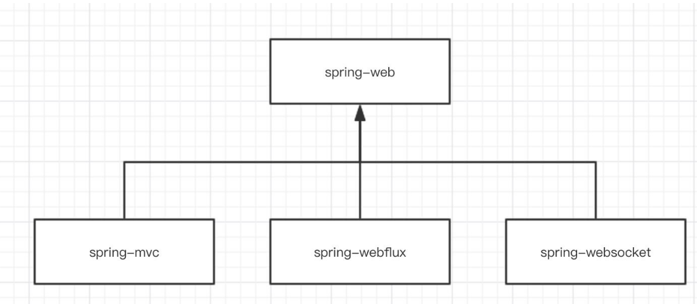

spring-webmvc 不是一个单独的项目，它有依赖的爸爸 spring-web 项目，也有两个兄弟 spring-webflux 和 spring-websocket 项目。


> 2、org.springframework.context.ConfigurableApplicationContext#refresh方法


# 1、容器的初始化（一）之 Root WebApplicationContext 容器

 ContextLoaderListener 的类图

 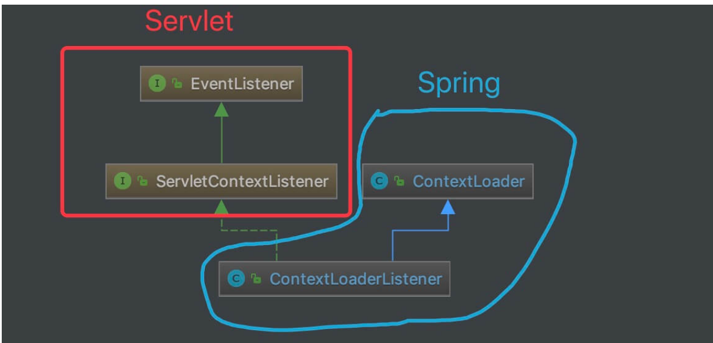

 包含两个构造函数。后面两个方法是ServletContextListener接口定义的方法

 调用父类 ContextLoader 的 #initWebApplicationContext(ServletContext servletContext) 方法，初始化 WebApplicationContext 对象。

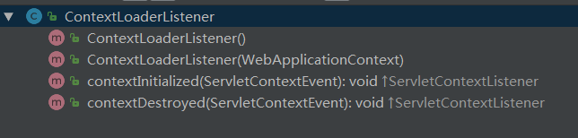

ContextLoader类的结构

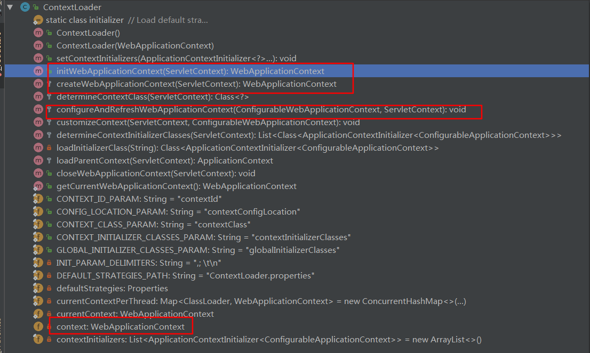

ServletContextListener接口

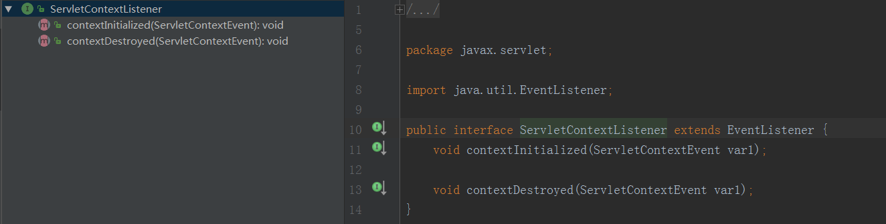

> 调试

执行 ContextLoaderTests#testContextLoaderListenerWithDefaultContext() 单元测试方法，即可执行本文涉及的一些逻辑。


# 2、容器的初始化（二）之 Servlet WebApplicationContext 容器

DispatcherServlet 的类图如下，可见HttpServletBean 负责连接spring和servlet。

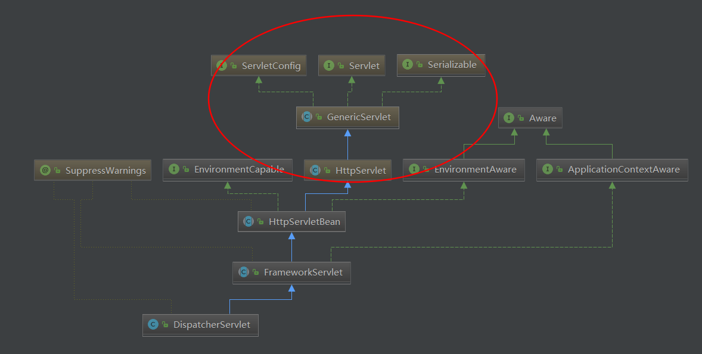

优化后的版本

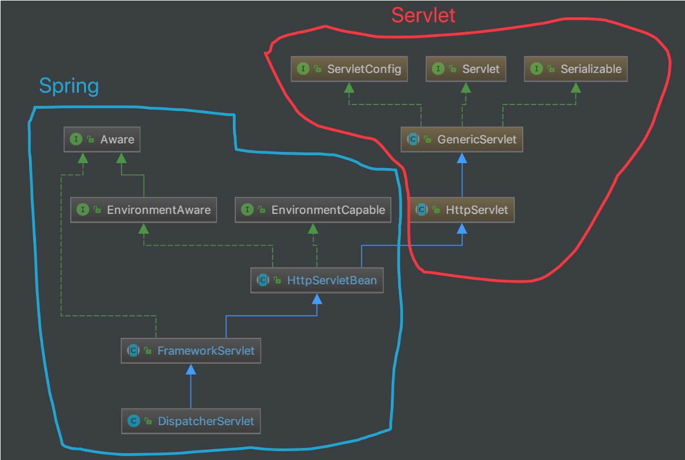


> 调试

执行 DispatcherServletTests#configuredDispatcherServlets() 单元测试方法，即可执行本文涉及的一些逻辑。

## DispatcherServlet继承类图详解

1、javax.servlet.Servlet[接口]

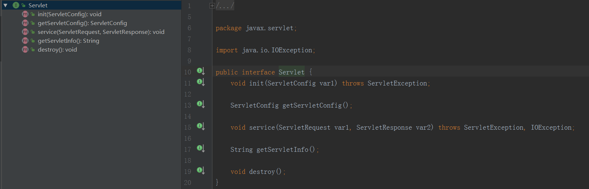

2、javax.servlet.GenericServlet [抽象类]

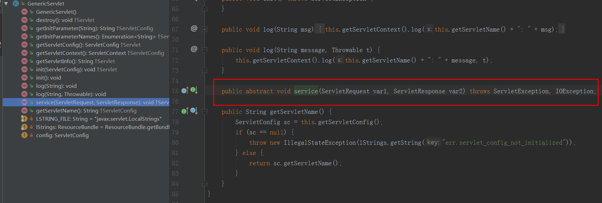

备注：这里的service是一个抽象的方法

public abstract void service(ServletRequest var1, ServletResponse var2) throws ServletException, IOException;


3、javax.servlet.http.HttpServlet[抽象类]

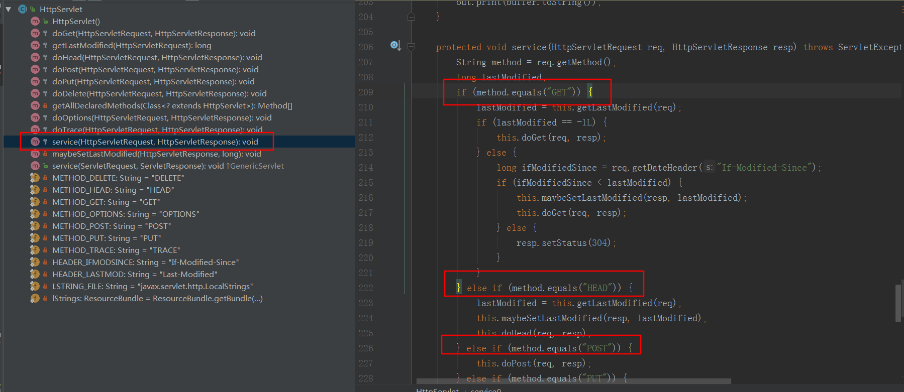

对service进行了实现，我们一般编写原始的servlet业务类就是继承这个抽象类，然后重新对应的方法，

```java
protected void service(HttpServletRequest req, HttpServletResponse resp) throws ServletException, IOException {
        String method = req.getMethod();
        long lastModified;
        if (method.equals("GET")) {
            lastModified = this.getLastModified(req);
            if (lastModified == -1L) {
                this.doGet(req, resp);
            } else {
                long ifModifiedSince = req.getDateHeader("If-Modified-Since");
                if (ifModifiedSince < lastModified) {
                    this.maybeSetLastModified(resp, lastModified);
                    this.doGet(req, resp);
                } else {
                    resp.setStatus(304);
                }
            }
        } else if (method.equals("HEAD")) {
            lastModified = this.getLastModified(req);
            this.maybeSetLastModified(resp, lastModified);
            this.doHead(req, resp);
        } else if (method.equals("POST")) {
            this.doPost(req, resp);
        } else if (method.equals("PUT")) {
            this.doPut(req, resp);
        } else if (method.equals("DELETE")) {
            this.doDelete(req, resp);
        } else if (method.equals("OPTIONS")) {
            this.doOptions(req, resp);
        } else if (method.equals("TRACE")) {
            this.doTrace(req, resp);
        } else {
            String errMsg = lStrings.getString("http.method_not_implemented");
            Object[] errArgs = new Object[]{method};
            errMsg = MessageFormat.format(errMsg, errArgs);
            resp.sendError(501, errMsg);
        }

    }

```

4、org.springframework.web.servlet.HttpServletBean

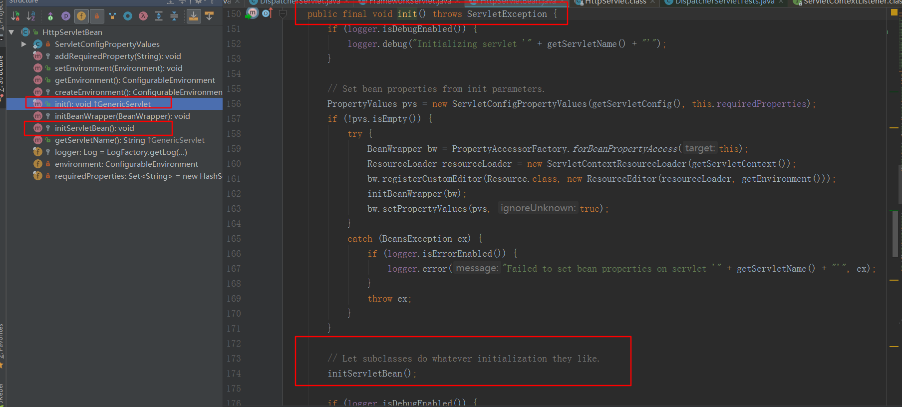

这里有两个重要的方法

org.springframework.web.servlet.HttpServletBean#init   重新servlet中的方法，然后定义一个空的函数org.springframework.web.servlet.HttpServletBean#initServletBean，让子类在servlet初始化的时候进行加载。[钩子函数]


5、org.springframework.web.servlet.FrameworkServlet ，创建一个servlet's WebApplicationContext

重新函数org.springframework.web.servlet.HttpServletBean#initServletBean

```java
/**
	 * Overridden method of {@link HttpServletBean}, invoked after any bean properties
	 * have been set. Creates this servlet's WebApplicationContext.
	 */
	@Override
	protected final void initServletBean() throws ServletException {
		getServletContext().log("Initializing Spring FrameworkServlet '" + getServletName() + "'");
		if (logger.isInfoEnabled()) {
			logger.info("FrameworkServlet '" + getServletName() + "': initialization started");
		}
		long startTime = System.currentTimeMillis();

		try {
			this.webApplicationContext = initWebApplicationContext();
			initFrameworkServlet();
		}
		catch (ServletException | RuntimeException ex) {
			logger.error("Context initialization failed", ex);
			throw ex;
		}

		if (logger.isInfoEnabled()) {
			long elapsedTime = System.currentTimeMillis() - startTime;
			logger.info("FrameworkServlet '" + getServletName() + "': initialization completed in " +
					elapsedTime + " ms");
		}
	}

```

重要，重写了service等方法

```java
/**
	 * Override the parent class implementation in order to intercept PATCH requests.
	 */
	@Override
	protected void service(HttpServletRequest request, HttpServletResponse response)
			throws ServletException, IOException {

		HttpMethod httpMethod = HttpMethod.resolve(request.getMethod());
		if (httpMethod == HttpMethod.PATCH || httpMethod == null) {
			processRequest(request, response);//重点
		}
		else {
			super.service(request, response);
		}
	}
```


```java
/**
	 * Process this request, publishing an event regardless of the outcome.
	 * <p>The actual event handling is performed by the abstract
	 * {@link #doService} template method.
	 */
	protected final void processRequest(HttpServletRequest request, HttpServletResponse response)
			throws ServletException, IOException {

		long startTime = System.currentTimeMillis();
		Throwable failureCause = null;

		LocaleContext previousLocaleContext = LocaleContextHolder.getLocaleContext();
		LocaleContext localeContext = buildLocaleContext(request);

		RequestAttributes previousAttributes = RequestContextHolder.getRequestAttributes();
		ServletRequestAttributes requestAttributes = buildRequestAttributes(request, response, previousAttributes);

		WebAsyncManager asyncManager = WebAsyncUtils.getAsyncManager(request);
		asyncManager.registerCallableInterceptor(FrameworkServlet.class.getName(), new RequestBindingInterceptor());

		initContextHolders(request, localeContext, requestAttributes);

		try {
			doService(request, response);//空函数，让子类进行处理
		}
		catch (ServletException | IOException ex) {
			failureCause = ex;
			throw ex;
		}
		catch (Throwable ex) {
			failureCause = ex;
			throw new NestedServletException("Request processing failed", ex);
		}

		finally {
			resetContextHolders(request, previousLocaleContext, previousAttributes);
			if (requestAttributes != null) {
				requestAttributes.requestCompleted();
			}

			if (logger.isDebugEnabled()) {
				if (failureCause != null) {
					this.logger.debug("Could not complete request", failureCause);
				}
				else {
					if (asyncManager.isConcurrentHandlingStarted()) {
						logger.debug("Leaving response open for concurrent processing");
					}
					else {
						this.logger.debug("Successfully completed request");
					}
				}
			}

			publishRequestHandledEvent(request, response, startTime, failureCause);
		}
	}

```


org.springframework.web.servlet.DispatcherServlet实现了该方法来转发请求

```java
protected abstract void doService(HttpServletRequest request, HttpServletResponse response)
			throws Exception;
```

doxxx等方法的处理也是让processRequest(request, response);进行处理，间接让org.springframework.web.servlet.DispatcherServlet的doService处理。

```java

@Override
	protected final void doGet(HttpServletRequest request, HttpServletResponse response)
			throws ServletException, IOException {

		processRequest(request, response);
	}
```


6、org.springframework.web.servlet.DispatcherServlet


实现上面的doService方法，所有的请求处理入口方法。

```java

/**
	 * Exposes the DispatcherServlet-specific request attributes and delegates to {@link #doDispatch}
	 * for the actual dispatching.
	 */
	@Override
	protected void doService(HttpServletRequest request, HttpServletResponse response) throws Exception {
		if (logger.isDebugEnabled()) {
			String resumed = WebAsyncUtils.getAsyncManager(request).hasConcurrentResult() ? " resumed" : "";
			logger.debug("DispatcherServlet with name '" + getServletName() + "'" + resumed +
					" processing " + request.getMethod() + " request for [" + getRequestUri(request) + "]");
		}

		// Keep a snapshot of the request attributes in case of an include,
		// to be able to restore the original attributes after the include.
		Map<String, Object> attributesSnapshot = null;
		if (WebUtils.isIncludeRequest(request)) {
			attributesSnapshot = new HashMap<>();
			Enumeration<?> attrNames = request.getAttributeNames();
			while (attrNames.hasMoreElements()) {
				String attrName = (String) attrNames.nextElement();
				if (this.cleanupAfterInclude || attrName.startsWith(DEFAULT_STRATEGIES_PREFIX)) {
					attributesSnapshot.put(attrName, request.getAttribute(attrName));
				}
			}
		}

		// Make framework objects available to handlers and view objects.
		request.setAttribute(WEB_APPLICATION_CONTEXT_ATTRIBUTE, getWebApplicationContext());
		request.setAttribute(LOCALE_RESOLVER_ATTRIBUTE, this.localeResolver);
		request.setAttribute(THEME_RESOLVER_ATTRIBUTE, this.themeResolver);
		request.setAttribute(THEME_SOURCE_ATTRIBUTE, getThemeSource());

		if (this.flashMapManager != null) {
			FlashMap inputFlashMap = this.flashMapManager.retrieveAndUpdate(request, response);
			if (inputFlashMap != null) {
				request.setAttribute(INPUT_FLASH_MAP_ATTRIBUTE, Collections.unmodifiableMap(inputFlashMap));
			}
			request.setAttribute(OUTPUT_FLASH_MAP_ATTRIBUTE, new FlashMap());
			request.setAttribute(FLASH_MAP_MANAGER_ATTRIBUTE, this.flashMapManager);
		}

		try {
			doDispatch(request, response);//让doDispatch进行处理
		}
		finally {
			if (!WebAsyncUtils.getAsyncManager(request).isConcurrentHandlingStarted()) {
				// Restore the original attribute snapshot, in case of an include.
				if (attributesSnapshot != null) {
					restoreAttributesAfterInclude(request, attributesSnapshot);
				}
			}
		}
	}

```

总结：

主要是根据接口javax.servlet.Servlet的两个主要方法javax.servlet.Servlet#init和javax.servlet.Servlet#service，延伸出来的两条处理逻辑线。

第一条线：完成WebApplicationContext的初始化

```java
javax.servlet.Servlet#init(ServletConfig var1))
    javax.servlet.GenericServlet#init(javax.servlet.ServletConfig)
    javax.servlet.GenericServlet#init()
        org.springframework.web.servlet.HttpServletBean#init
        org.springframework.web.servlet.HttpServletBean#initServletBean
            org.springframework.web.servlet.FrameworkServlet#initServletBean [结束]
```

第二条线：接收请求并处理

```java
javax.servlet.Servlet#service(ServletRequest var1, ServletResponse var2)
    javax.servlet.GenericServlet#service(ServletRequest var1, ServletResponse var2)
        javax.servlet.http.HttpServlet#service(javax.servlet.http.HttpServletRequest, javax.servlet.http.HttpServletResponse)  [请求参数在这里转变]
            org.springframework.web.servlet.FrameworkServlet#service
            org.springframework.web.servlet.FrameworkServlet#processRequest
            org.springframework.web.servlet.FrameworkServlet#doService
                org.springframework.web.servlet.DispatcherServlet#doService
                org.springframework.web.servlet.DispatcherServlet#doDispatch  【处理业务逻辑的入口】
```


# 3、容器的初始化（三）之 Servlet 3.0 集成

[参考](http://svip.iocoder.cn/Spring-MVC/context-init-integration-with-Servlet-3.0/)


 Servlet 3.0 以前的时代

为了体现出整个演进过程，还是来回顾下 n 年前我们是怎么写 servlet 和 filter 代码的。

项目结构（本文都采用 maven 项目结构）

```
.
├── pom.xml
├── src
    ├── main
    │   ├── java
    │   │   └── moe
    │   │       └── cnkirito
    │   │           ├── filter
    │   │           │   └── HelloWorldFilter.java
    │   │           └── servlet
    │   │               └── HelloWorldServlet.java
    │   └── resources
    │       └── WEB-INF
    │           └── web.xml
    └── test
        └── java
```

```java

public class HelloWorldServlet extends HttpServlet {

    @Override
    protected void doGet(HttpServletRequest req, HttpServletResponse resp) throws ServletException, IOException {
        resp.setContentType("text/plain");
        PrintWriter out = resp.getWriter();
        out.println("hello world");
    }

}
public class HelloWorldFilter implements Filter {

    @Override
    public void init(FilterConfig filterConfig) throws ServletException {

    }

    @Override
    public void doFilter(ServletRequest servletRequest, ServletResponse servletResponse, FilterChain filterChain) throws IOException, ServletException {
        System.out.println("触发 hello world 过滤器...");
        filterChain.doFilter(servletRequest,servletResponse);
    }

    @Override
    public void destroy() {

    }
}
```

别忘了在 web.xml 中配置 servlet 和 filter 。


```xml

<?xml version="1.0" encoding="UTF-8"?>
<web-app xmlns="http://java.sun.com/xml/ns/javaee"
           xmlns:xsi="http://www.w3.org/2001/XMLSchema-instance"
           xsi:schemaLocation="http://java.sun.com/xml/ns/javaee
        http://java.sun.com/xml/ns/javaee/web-app_4_0.xsd"
           version="4.0">

    <servlet>
        <servlet-name>HelloWorldServlet</servlet-name>
        <servlet-class>moe.cnkirito.servlet.HelloWorldServlet</servlet-class>
    </servlet>

    <servlet-mapping>
        <servlet-name>HelloWorldServlet</servlet-name>
        <url-pattern>/hello</url-pattern>
    </servlet-mapping>

    <filter>
        <filter-name>HelloWorldFilter</filter-name>
        <filter-class>moe.cnkirito.filter.HelloWorldFilter</filter-class>
    </filter>
    <filter-mapping>
        <filter-name>HelloWorldFilter</filter-name>
        <url-pattern>/hello</url-pattern>
    </filter-mapping>

</web-app>

```


# 4、容器的初始化（四）之 Spring Boot 集成

[参考](http://svip.iocoder.cn/Spring-MVC/context-init-integration-with-SpringBoot/)


# 5、组件一览

Spring MVC 一共有九大核心组件，分别是：

- MultipartResolver
- LocaleResolver
- ThemeResolver
- HandlerMapping
- HandlerAdapter
- HandlerExceptionResolver
- RequestToViewNameTranslator
- ViewResolver
- FlashMapManager

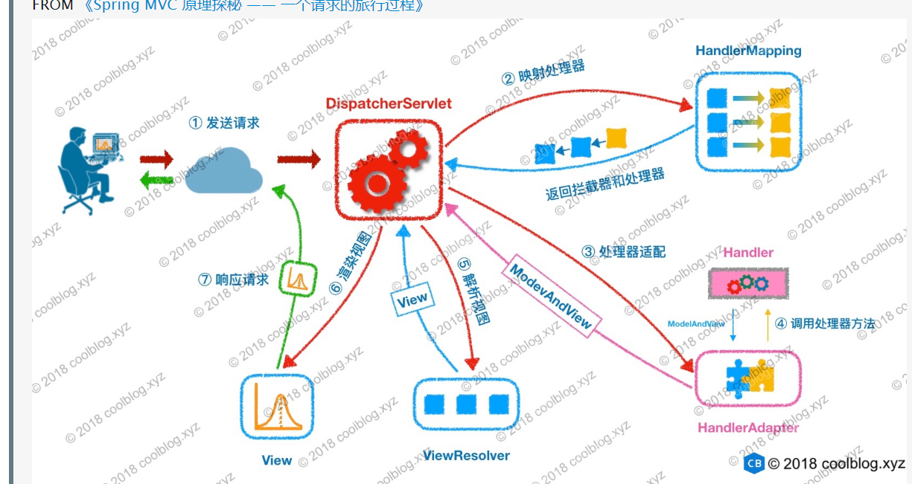

备注：当然，这个图并没有包括所有的组件，主要涉及最核心的组件

## 1、MultipartResolver

org.springframework.web.multipart.MultipartResolver ，内容类型( Content-Type )为 multipart/* 的请求的解析器接口。


## 2、LocaleResolver

org.springframework.web.servlet.LocaleResolver ，本地化( 国际化 )解析器接口。

## 3、ThemeResolver
org.springframework.web.servlet.ThemeResolver ，主题解析器接口

## 4、HandlerMapping

org.springframework.web.servlet.HandlerMapping ，处理器匹配接口，根据请求( handler )获得其的处理器( handler )和拦截器们( HandlerInterceptor 数组 )

## 5、HandlerAdapter
org.springframework.web.servlet.HandlerAdapter ，处理器适配器接口

## 6、HandlerExceptionResolver

org.springframework.web.servlet.HandlerExceptionResolver ，处理器异常解析器接口，将处理器( handler )执行时发生的异常，解析( 转换 )成对应的 ModelAndView 结果

## 7、RequestToViewNameTranslator
org.springframework.web.servlet.RequestToViewNameTranslator ，请求到视图名的转换器接口。

## 8、ViewResolver

org.springframework.web.servlet.ViewResolver ，实体解析器接口，根据视图名和国际化，获得最终的视图 View 对象。

## 9、FlashMapManager
org.springframework.web.servlet.FlashMapManager ，FlashMap 管理器接口，负责重定向时，保存参数到临时存储中。


# 6、请求处理一览


比较简单，调试 org.springframework.web.servlet.DispatcherServletTests 这个单元测试类，可以运行各种单元测试方法，执行各种情况。


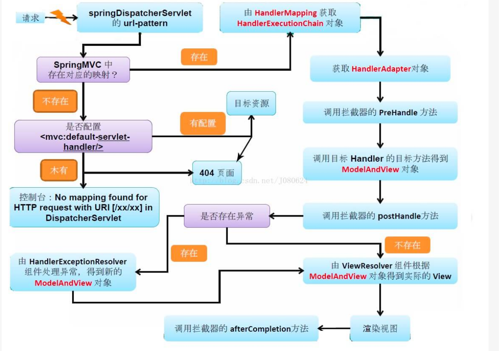


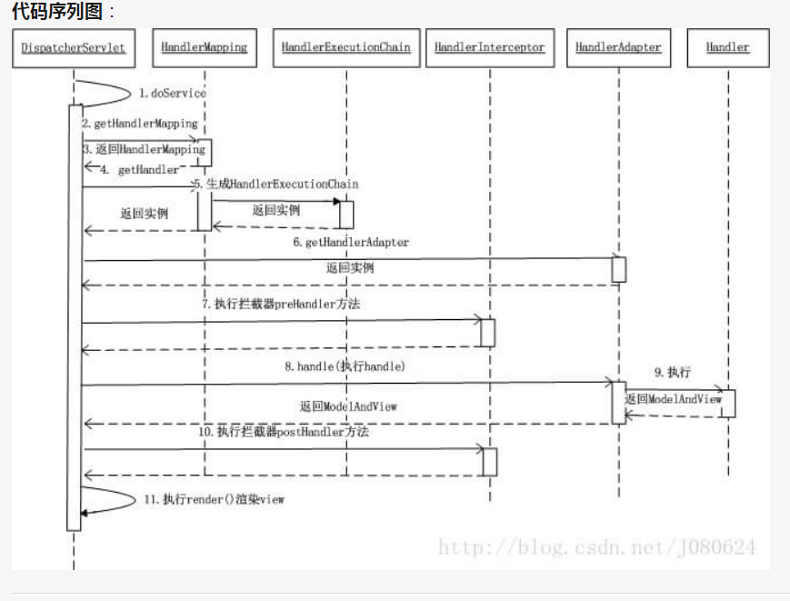


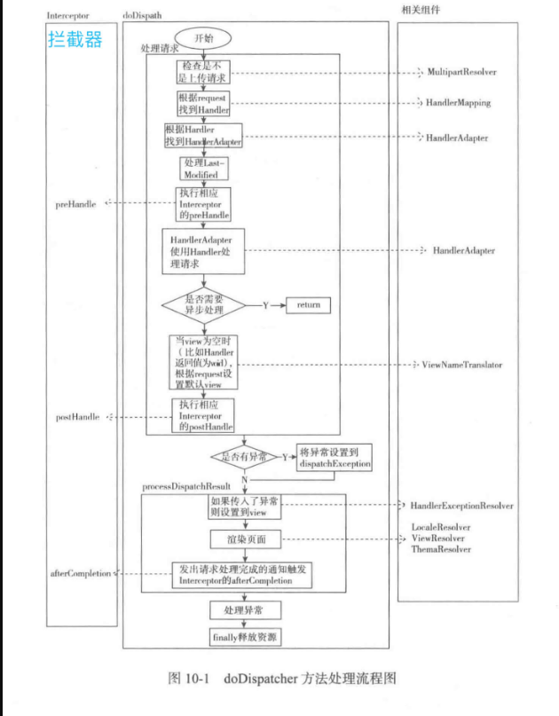


# 7、HandlerMapping 组件（一）之 AbstractHandlerMapping


# 8、 HandlerMapping 组件（二）之 HandlerInterceptor


# 9、HandlerMapping 组件（三）之 AbstractHandlerMethodMapping


# 10、HandlerMapping 组件（四）之 AbstractUrlHandlerMapping

# 11、HandlerAdapter 组件（一）之 HandlerAdapter
 
# 12、HandlerAdapter 组件（二）之 ServletInvocableHandlerMethod

# 13、HandlerAdapter 组件（三）之 HandlerMethodArgumentResolver


# 14、HandlerAdapter 组件（四）之 HandlerMethodReturnValueHandler


# 15、HandlerAdapter 组件（五）之 HttpMessageConverter


# 16、HandlerExceptionResolver 组件

# 17、RequestToViewNameTranslator 组件


# 18、LocaleResolver 组件

# 19、ThemeResolver 组件


# 20、ViewResolver 组件


# 21、MultipartResolver 组件


