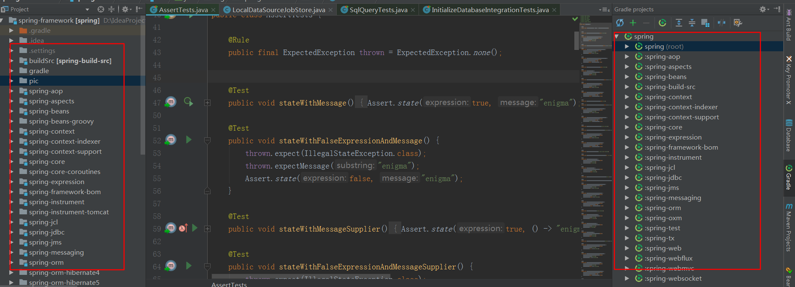

# 初步本地构建

1、从spring5.0.x构建自己的分支


2、导入到idea中

idea2017.2.2 + gradle4.8+jdk1.8



3、整体build或者按照官方给的构建测试有问题

gradle.bat cleanIdea :spring-oxm:compileTestJava


有文章说是：编译github的最新spring源码发现该问题，主要是kotlin版本不一致导致的 ，发现并不能解决问题


修改了之后还是有问题。

并没有解决这个问题，但是貌似不影响局部模块的单元测试。

```java
Circular dependency between the following tasks:
:spring-beans:compileGroovy
\--- :spring-beans:compileJava
     \--- :spring-beans:compileKotlin
          \--- :spring-beans:compileGroovy (*)
```


- [编译spring源码](https://blog.csdn.net/lianjiaokeji/article/details/82177236)
- [Spring源码导入IDEA](https://segmentfault.com/a/1190000017191299?utm_source=tag-newest)
- [使用idea和gradle编译spring5源码](https://blog.csdn.net/baomw/article/details/83956300)
- [spring学习-01编译spring5.0源码](https://blog.csdn.net/qq_38412637/article/details/85255625)


```
Error:(30, 0) No such property: values for class: org.gradle.api.internal.tasks.DefaultTaskDependency
Possible solutions: values
Open File(spring-beans\spring-beans.gradle ）
点击：Open File 然后注释掉
//compileGroovy.dependsOn = compileGroovy.taskDependencies.values - ‘compileJava’
```


4、执行

先执行这两个任务


后续的如果在运行当前模块发现找不到某一个包的类的话，先执行一下对应包下的任意一个单元测试类即可[亲测测可用]

比如运行：XmlBeanDefinitionReaderTests

新建一个包测试自己的代码：


疑问：

为什么我从其他分支拉下来的，执行gradle.bat cleanIdea :spring-oxm:compileTestJava可以成功，而5.0.x分支却不行？？？


# 遇到的其他问题

## 问题1

```java
Error:Kotlin: [Internal Error] java.lang.AbstractMethodError: org.jetbrains.kotlin.scripting.compiler.plugin.ScriptingCompilerConfigurationComponentRegistrar.registerProjectComponents(Lcom/intellij/mock/MockProject;Lorg/jetbrains/kotlin/config/CompilerConfiguration;)V
	at org.jetbrains.kotlin.cli.jvm.compiler.KotlinCoreEnvironment.<init>(KotlinCoreEnvironment.kt:172)
	at org.jetbrains.kotlin.cli.jvm.compiler.KotlinCoreEnvironment.<init>(KotlinCoreEnvironment.kt:114)
	at org.jetbrains.kotlin.cli.jvm.compiler.KotlinCoreEnvironment$Companion.createForProduction(KotlinCoreEnvironment.kt:382)
	at org.jetbrains.kotlin.cli.jvm.K2JVMCompiler.createCoreEnvironment(K2JVMCompiler.kt:281)
	at org.jetbrains.kotlin.cli.jvm.K2JVMCompiler.createEnvironmentWithScriptingSupport(K2JVMCompiler.kt:271)
	at org.jetbrains.kotlin.cli.jvm.K2JVMCompiler.doExecute(K2JVMCompiler.kt:163)
	at org.jetbrains.kotlin.cli.jvm.K2JVMCompiler.doExecute(K2JVMCompiler.kt:58)
	at org.jetbrains.kotlin.cli.common.CLICompiler.execImpl(CLICompiler.java:93)
	at org.jetbrains.kotlin.cli.common.CLICompiler.execImpl(CLICompiler.java:46)
	at org.jetbrains.kotlin.cli.common.CLITool.exec(CLITool.kt:92)
	at org.jetbrains.kotlin.daemon.CompileServiceImpl$compile$$inlined$ifAlive$lambda$1.invoke(CompileServiceImpl.kt:381)
	at org.jetbrains.kotlin.daemon.CompileServiceImpl$compile$$inlined$ifAlive$lambda$1.invoke(CompileServiceImpl.kt:98)
	at org.jetbrains.kotlin.daemon.CompileServiceImpl$doCompile$$inlined$ifAlive$lambda$2.invoke(CompileServiceImpl.kt:832)
	at org.jetbrains.kotlin.daemon.CompileServiceImpl$doCompile$$inlined$ifAlive$lambda$2.invoke(CompileServiceImpl.kt:98)
	at org.jetbrains.kotlin.daemon.common.DummyProfiler.withMeasure(PerfUtils.kt:137)
	at org.jetbrains.kotlin.daemon.CompileServiceImpl.checkedCompile(CompileServiceImpl.kt:859)
	at org.jetbrains.kotlin.daemon.CompileServiceImpl.doCompile(CompileServiceImpl.kt:831)
	at org.jetbrains.kotlin.daemon.CompileServiceImpl.compile(CompileServiceImpl.kt:379)
	at sun.reflect.NativeMethodAccessorImpl.invoke0(Native Method)
	at sun.reflect.NativeMethodAccessorImpl.invoke(NativeMethodAccessorImpl.java:62)
	at sun.reflect.DelegatingMethodAccessorImpl.invoke(DelegatingMethodAccessorImpl.java:43)
	at java.lang.reflect.Method.invoke(Method.java:498)
	at sun.rmi.server.UnicastServerRef.dispatch(UnicastServerRef.java:357)
	at sun.rmi.transport.Transport$1.run(Transport.java:200)
	at sun.rmi.transport.Transport$1.run(Transport.java:197)
	at java.security.AccessController.doPrivileged(Native Method)
	at sun.rmi.transport.Transport.serviceCall(Transport.java:196)
	at sun.rmi.transport.tcp.TCPTransport.handleMessages(TCPTransport.java:573)
	at sun.rmi.transport.tcp.TCPTransport$ConnectionHandler.run0(TCPTransport.java:834)
	at sun.rmi.transport.tcp.TCPTransport$ConnectionHandler.lambda$run$0(TCPTransport.java:688)
	at java.security.AccessController.doPrivileged(Native Method)
	at sun.rmi.transport.tcp.TCPTransport$ConnectionHandler.run(TCPTransport.java:687)
	at java.util.concurrent.ThreadPoolExecutor.runWorker(ThreadPoolExecutor.java:1149)
	at java.util.concurrent.ThreadPoolExecutor$Worker.run(ThreadPoolExecutor.java:624)
	at java.lang.Thread.run(Thread.java:748)

```

这个问题是Kotlin插件版本的问题，升级一下即可

- [Spring源码分析——调试环境搭建（可能是最省事的构建方法）](https://www.w3xue.com/exp/article/201811/7228.html)

## 问题2

```java
> Task :spring-jms:jar UP-TO-DATE
> Task :api
D:\IdeaProjects\opensource\spring-framework\spring-web\src\main\java\org\springframework\http\codec\multipart\DefaultMultipartMessageReader.java:255: 错误: 编码GBK的不可映射字符
				builder.append("鈵?");
				                 ^
D:\IdeaProjects\opensource\spring-framework\spring-web\src\main\java\org\springframework\http\codec\multipart\DefaultMultipartMessageReader.java:258: 错误: 编码GBK的不可映射字符
				builder.append("鈵?");
				                 ^
2 个错误

> Task :api FAILED
```

更改了idea的文件编码为utf-8还是有问题？？？


## 问题3


```java
Error:Kotlin: [Internal Error] java.lang.LinkageError: loader constraint violation: loader (instance of org/jetbrains/kotlin/cli/jvm/plugins/PluginURLClassLoader$SelfThenParentURLClassLoader) previously initiated loading for a different type with name "kotlin/sequences/Sequence"
	at java.lang.ClassLoader.defineClass1(Native Method)
	at java.lang.ClassLoader.defineClass(ClassLoader.java:763)
	at java.security.SecureClassLoader.defineClass(SecureClassLoader.java:142)
	at java.net.URLClassLoader.defineClass(URLClassLoader.java:467)
	at java.net.URLClassLoader.access$100(URLClassLoader.java:73)
	at java.net.URLClassLoader$1.run(URLClassLoader.java:368)
	at java.net.URLClassLoader$1.run(URLClassLoader.java:362)
	at java.security.AccessController.doPrivileged(Native Method)
	at java.net.URLClassLoader.findClass(URLClassLoader.java:361)
	at org.jetbrains.kotlin.cli.jvm.plugins.PluginURLClassLoader$SelfThenParentURLClassLoader.findClass(PluginURLClassLoader.kt:47)
	at java.lang.ClassLoader.loadClass(ClassLoader.java:424)
	at java.lang.ClassLoader.loadClass(ClassLoader.java:357)
	at java.lang.ClassLoader.defineClass1(Native Method)
	at java.lang.ClassLoader.defineClass(ClassLoader.java:763)
	at java.security.SecureClassLoader.defineClass(SecureClassLoader.java:142)
	at java.net.URLClassLoader.defineClass(URLClassLoader.java:467)
	at java.net.URLClassLoader.access$100(URLClassLoader.java:73)
	at java.net.URLClassLoader$1.run(URLClassLoader.java:368)
	at java.net.URLClassLoader$1.run(URLClassLoader.java:362)
	at java.security.AccessController.doPrivileged(Native Method)
	at java.net.URLClassLoader.findClass(URLClassLoader.java:361)
	at org.jetbrains.kotlin.cli.jvm.plugins.PluginURLClassLoader$SelfThenParentURLClassLoader.findClass(PluginURLClassLoader.kt:47)
	at java.lang.ClassLoader.loadClass(ClassLoader.java:424)
	at java.lang.ClassLoader.loadClass(ClassLoader.java:357)
	at kotlin.coroutines.experimental.SequenceBuilderKt__SequenceBuilderKt.buildSequence(SequenceBuilder.kt:24)
	at org.jetbrains.kotlin.scripting.compiler.plugin.ScriptiDefinitionsFromClasspathDiscoverySourceKt.discoverScriptTemplatesInClasspath(ScriptiDefinitionsFromClasspathDiscoverySource.kt:50)
	at org.jetbrains.kotlin.scripting.compiler.plugin.ScriptDefinitionsFromClasspathDiscoverySource.<init>(ScriptiDefinitionsFromClasspathDiscoverySource.kt:36)
	at org.jetbrains.kotlin.scripting.compiler.plugin.ScriptingCompilerConfigurationExtension.updateConfiguration(ScriptingCompilerConfigurationExtension.kt:56)
	at org.jetbrains.kotlin.cli.jvm.compiler.KotlinCoreEnvironment.<init>(KotlinCoreEnvironment.kt:213)
	at org.jetbrains.kotlin.cli.jvm.compiler.KotlinCoreEnvironment.<init>(KotlinCoreEnvironment.kt:117)
	at org.jetbrains.kotlin.cli.jvm.compiler.KotlinCoreEnvironment$Companion.createForProduction(KotlinCoreEnvironment.kt:446)
	at org.jetbrains.kotlin.cli.jvm.K2JVMCompiler.createCoreEnvironment(K2JVMCompiler.kt:295)
	at org.jetbrains.kotlin.cli.jvm.K2JVMCompiler.doExecute(K2JVMCompiler.kt:147)
	at org.jetbrains.kotlin.cli.jvm.K2JVMCompiler.doExecute(K2JVMCompiler.kt:51)
	at org.jetbrains.kotlin.cli.common.CLICompiler.execImpl(CLICompiler.java:94)
	at org.jetbrains.kotlin.cli.common.CLICompiler.execImpl(CLICompiler.java:50)
	at org.jetbrains.kotlin.cli.common.CLITool.exec(CLITool.kt:88)
	at org.jetbrains.kotlin.daemon.CompileServiceImpl$compile$$inlined$ifAlive$lambda$1.invoke(CompileServiceImpl.kt:402)
	at org.jetbrains.kotlin.daemon.CompileServiceImpl$compile$$inlined$ifAlive$lambda$1.invoke(CompileServiceImpl.kt:101)
	at org.jetbrains.kotlin.daemon.CompileServiceImpl$doCompile$$inlined$ifAlive$lambda$2.invoke(CompileServiceImpl.kt:929)
	at org.jetbrains.kotlin.daemon.CompileServiceImpl$doCompile$$inlined$ifAlive$lambda$2.invoke(CompileServiceImpl.kt:101)
	at org.jetbrains.kotlin.daemon.common.DummyProfiler.withMeasure(PerfUtils.kt:137)
	at org.jetbrains.kotlin.daemon.CompileServiceImpl.checkedCompile(CompileServiceImpl.kt:969)
	at org.jetbrains.kotlin.daemon.CompileServiceImpl.doCompile(CompileServiceImpl.kt:928)
	at org.jetbrains.kotlin.daemon.CompileServiceImpl.compile(CompileServiceImpl.kt:400)
	at sun.reflect.NativeMethodAccessorImpl.invoke0(Native Method)
	at sun.reflect.NativeMethodAccessorImpl.invoke(NativeMethodAccessorImpl.java:62)
	at sun.reflect.DelegatingMethodAccessorImpl.invoke(DelegatingMethodAccessorImpl.java:43)
	at java.lang.reflect.Method.invoke(Method.java:498)
	at sun.rmi.server.UnicastServerRef.dispatch(UnicastServerRef.java:357)
	at sun.rmi.transport.Transport$1.run(Transport.java:200)
	at sun.rmi.transport.Transport$1.run(Transport.java:197)
	at java.security.AccessController.doPrivileged(Native Method)
	at sun.rmi.transport.Transport.serviceCall(Transport.java:196)
	at sun.rmi.transport.tcp.TCPTransport.handleMessages(TCPTransport.java:573)
	at sun.rmi.transport.tcp.TCPTransport$ConnectionHandler.run0(TCPTransport.java:834)
	at sun.rmi.transport.tcp.TCPTransport$ConnectionHandler.lambda$run$0(TCPTransport.java:688)
	at java.security.AccessController.doPrivileged(Native Method)
	at sun.rmi.transport.tcp.TCPTransport$ConnectionHandler.run(TCPTransport.java:687)
	at java.util.concurrent.ThreadPoolExecutor.runWorker(ThreadPoolExecutor.java:1149)
	at java.util.concurrent.ThreadPoolExecutor$Worker.run(ThreadPoolExecutor.java:624)
	at java.lang.Thread.run(Thread.java:748)

```

没有解决


## 问题4

用idea导入spring源码时，报：org/gradle/listener/ActionBroadcast错误时解决方法

解决：

plugins {
	id "org.sonarqube" version "2.5"
}

- [用idea导入spring源码时，报：org/gradle/listener/ActionBroadcast错误时解决方法](https://blog.csdn.net/linkforme/article/details/85274769)


## 问题5

Error:No such property: GradleVersion for class: JetGradlePlugin

解决：gradle版本太高更换版本即可


```

Error:(3, 0) No signature of method: static org.codehaus.groovy.transform.ImmutableASTTransformation.checkImmutable() is applicable for argument types: (java.lang.Class, java.lang.String, nebula.plugin.release.git.semver.ChangeScope, java.util.ArrayList, java.util.ArrayList) values: [class nebula.plugin.release.git.semver.SemVerStrategyState, ...]
Possible solutions: checkImmutable(java.lang.Class, java.lang.String, java.lang.Object), checkImmutable(java.lang.String, java.lang.String, java.lang.Object)
<a href="openFile:D:\IdeaProjects\opensource\zuul\build.gradle">Open File</a>


Error:(15, 0) Could not set unknown property 'port' for object of type org.akhikhl.gretty.GrettyExtension.
<a href="openFile:D:\IdeaProjects\opensource\gradle-examples\web-application\build.gradle">Open File</a>
```


          